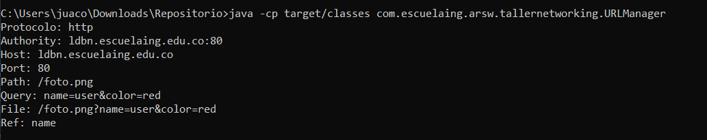
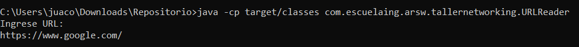
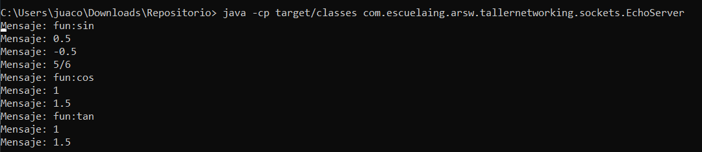
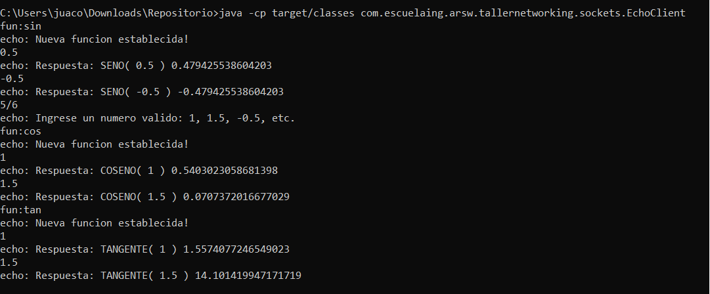
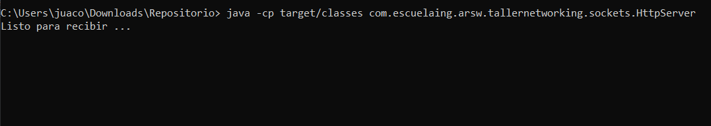

# HOMEWORK 2 ARSW (Taller Networking)

In this workshop we make an introduction to the main tools of the java.net package necessary to make UDP and TCP connections.

# EJERCICIO 1 - 3.1

Escriba un programa en el cual usted cree un objeto URL e imprima en pantalla cada uno de los datos que retornan los 8 métodos de la sección anterior.

```java
/**
 * EJERCICIO 1
 * @author juaco
 */
public class URLManager {
    
    /**
     * Url Manager, method main
     * @param args 
     */
    public static void main(String[] args){
        try {
                String siteURLString = "http://ldbn.escuelaing.edu.co:80/foto.png?name=user&color=red#name";
        URL siteUrl = new URL (siteURLString);
        System.out.println("Protocolo: "+ siteUrl.getProtocol());
        System.out.println("Authority: "+ siteUrl.getAuthority());
        System.out.println("Host: "+ siteUrl.getHost());
        System.out.println("Port: "+ siteUrl.getPort());
        System.out.println("Path: "+ siteUrl.getPath());
        System.out.println("Query: "+ siteUrl.getQuery());
        System.out.println("File: "+ siteUrl.getFile());
        System.out.println("Ref: "+ siteUrl.getRef());
        
        } catch (MalformedURLException ex) {
            Logger.getLogger(URLManager.class.getName()).log(Level.SEVERE, null, ex);
        }

    }
    
}
```




# EJERCICIO 2 - 3.2

Escriba una aplicación browser que pregunte una dirección URL al usuario y que lea datos de esa dirección y que los almacene en un archivo con el nombre resultado.html. Luego intente ver este archivo en el navegador.

```java
/**
 * EJERCICIO 2
 * @author juaco
 */
public class Browser {

    /**
     * Request a URL from the user, read the data and store it in a result.html file
     * @param url 
     * @throws MalformedURLException
     * @throws IOException 
     */
    public static void createHtml(String url) throws MalformedURLException, IOException {
        File archivo = new File("C:\\Users\\juaco\\Documents\\NetBeansProjects\\tallernetworking\\resultado.html");
        BufferedWriter bw = new BufferedWriter(new FileWriter(archivo));
        URL newUrl = new URL(url);
        try (BufferedReader reader
                = new BufferedReader(new InputStreamReader(newUrl.openStream()))) {
            String inputLine = null;
            while ((inputLine = reader.readLine()) != null) {
                bw.write(inputLine);
            }
            bw.close();
        } catch (IOException x) {
            System.err.println(x);
        }
    }
}
```




# EJERCICIO 2 - 4.3.2

Escriba un servidor que pueda recibir un número y responda con un operación sobre este número. Este servidor puede recibir un mensaje que empiece por “fun:”, si recibe este mensaje cambia la operación a las especificada. El servidor debe responder las funciones seno, coseno y tangente. Por defecto debe empezar calculando el coseno. Por ejemplo, si el primer número que recibe es 0, debe responder 1, si después recibe π/2 debe responder 0, si luego recibe “fun:sin” debe cambiar la operación actual a seno, es decir a a partir de ese momento debe calcular senos. Si enseguida recibe 0 debe responder 0. en el navegador.

```java
/**
 * Clase cliente que envıa datos y recibe respuestas 
 * @author juaco
 */
public class EchoClient {

    public static void main(String[] args) throws IOException {

        Socket echoSocket = null;
        PrintWriter out = null;
        BufferedReader in = null;

        try {
            echoSocket = new Socket("127.0.0.1", 35000);
            out = new PrintWriter(echoSocket.getOutputStream(), true);
            in = new BufferedReader(new InputStreamReader(
                    echoSocket.getInputStream()));
        } catch (UnknownHostException e) {
            System.err.println("Don’t know about host!.");
            System.exit(1);
        } catch (IOException e) {
            System.err.println("Couldn’t get I/O for "
                    + "the connection to: localhost.");
            System.exit(1);
        }

        BufferedReader stdIn = new BufferedReader(
                new InputStreamReader(System.in)
        );
        String userInput;

        while ((userInput = stdIn.readLine()) != null) {
            out.println(userInput);
            System.out.println("echo: " + in.readLine());
        }
        out.close();
        in.close();
        stdIn.close();
        echoSocket.close();
    }
}

/**
 * Clase servidor que regresa el mismo mensaje que lee
 * @author juaco
 */
public class EchoServer {

    public static void main(String[] args) throws IOException {
        ServerSocket serverSocket = null;
        try {
            serverSocket = new ServerSocket(35000);
        } catch (IOException e) {
            System.err.println("Could not listen on port: 35000.");
            System.exit(1);
        }
        Socket clientSocket = null;
        try {
            clientSocket = serverSocket.accept();
        } catch (IOException e) {
            System.err.println("Accept failed.");
            System.exit(1);
        }
        PrintWriter out = new PrintWriter(clientSocket.getOutputStream(), true);
        BufferedReader in = new BufferedReader(
                new InputStreamReader(
                        clientSocket.getInputStream()));
        String inputLine, outputLine;
        while ((inputLine = in.readLine()) != null) {
            System.out.println(
                    "Mensaje: " + inputLine
            );
            inputLine = inputLine.toLowerCase();
            outputLine = "Invalid request";
            if (inputLine.contains("fun:")) {
                outputLine = "Nueva funcion establecida!";
                if (inputLine.contains("sin")) {
                    Maths.setF(Functions.SENO);
                } else if (inputLine.contains("tan")) {
                    Maths.setF(Functions.TANGENTE);
                } else if (inputLine.contains("cos")) {
                    Maths.setF(Functions.COSENO);
                } else {
                    outputLine = "Respuesta: funcion invalida.";
                }
            }else if (inputLine.contains("bye")){
                break;
            } else {
                try {
                    outputLine = "Respuesta: " + Maths.getF().name() + "( " + inputLine + " ) " + Maths.fun(Double.parseDouble(inputLine));
                } catch (NumberFormatException e) {
                    outputLine="Ingrese un numero valido, e.g., 1, 1.5, -0.5, etc.";
                }
            }
            out.println(outputLine);
        }
        out.close();
        in.close();
        clientSocket.close();
        serverSocket.close();
    }
}
```




# EJERCICIO 1 - 4.5.1

Escriba un servidor web que soporte múltiples solicitudes seguidas (no concurrentes). El servidor debe retornar todos los archivos solicitados, incluyendo páginas html e imágenes.

```java
public class HttpServer {

    public static void main(String[] args) throws IOException {
        while (true) {
            ServerSocket serverSocket = null;
            try {
                serverSocket = new ServerSocket(getPort());
            } catch (IOException e) {
                System.err.println("Could not listen on port: 35000.");
                System.exit(1);
            }
            Socket clientSocket = null;
            try {
                System.out.println("Listo para recibir ...");
                clientSocket = serverSocket.accept();
            } catch (IOException e) {
                System.err.println("Accept failed.");
                System.exit(1);
            }

            PrintWriter out = new PrintWriter(clientSocket.getOutputStream(), true);
            BufferedReader in = new BufferedReader(
                    new InputStreamReader(
                            clientSocket.getInputStream()
                    ));
            String inputLine, outputLine;
            //Leer la peticion que hace el cliente.
            inputLine = in.readLine();
            //Se busca en el encabezado de la peticion para saber si el recurso solicitado es png o html.
            if (inputLine != null && inputLine.contains("GET")) {
                String[] encabezado = inputLine.split(" ");
                String recusro = encabezado[1];
                if (recusro.contains("png")) {
                    byte[] image = Reader.imageReader(Search.searchResource(inputLine));
                    DataOutputStream binaryOut;
                    binaryOut = new DataOutputStream(clientSocket.getOutputStream());
                    binaryOut.writeBytes("HTTP/1.1 200 OK \r\n");
                    binaryOut.writeBytes("Content-Type: image/png\r\n");
                    binaryOut.writeBytes("Content-Length: " + image.length);
                    binaryOut.writeBytes("\r\n\r\n");
                    binaryOut.write(image);
                    binaryOut.close();
                } else {
                    try {
                        out.println(Reader.htmlReader(Search.searchResource(inputLine)));
                    } catch (IOException e) {
                        out.println("HTTP/1.1 404 NOT FOUND\r\n"
                                + "Content-Type: text/html\r\n"
                                + "\r\n"
                                + "404 NOT FOUND \n"
                                + e.getMessage());
                    }
                }
            }
            out.close();
            in.close();
            clientSocket.close();
            serverSocket.close();
        }
    }

    /**
     * La siguiente funcion retorna un numero entero, que correspondera al
     * puerto por el cual se establecera la comunicacion entre el cliente y el
     * servidor.
     *
     * @return int
     */
    public static int getPort() {
        if (System.getenv("PORT") != null) {
            return Integer.parseInt(System.getenv("PORT"));
        }
        return 4567; //returns default port if heroku-port isn't set (i.e.on localhost)
    }

}
```




# Diagram


## PRE-REQUISITES

* Java jdk > 7
* Maven (Apache Maven)
* Git
  

## BUILT

* [Maven](https://maven.apache.org/) - Dependency Management
* [JAVA JDK 8](http://www.oracle.com/technetwork/java/javase/overview/index.html) - Building
* [JUnit 3.8.1](https://mvnrepository.com/artifact/junit/junit/3.8.1) - Test


## AUTHOR

* **JUAN CAMILO ORTIZ MEDINA** - [Juaco9502](https://github.com/juaco9502)


## LICENSE

This project is licensed under the GNU General Public License - [LICENSE](LICENSE) 